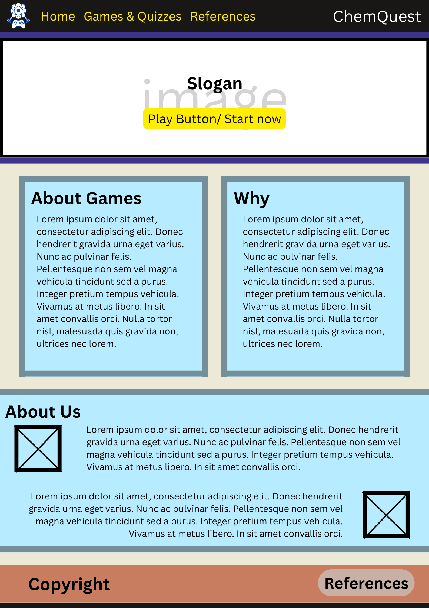
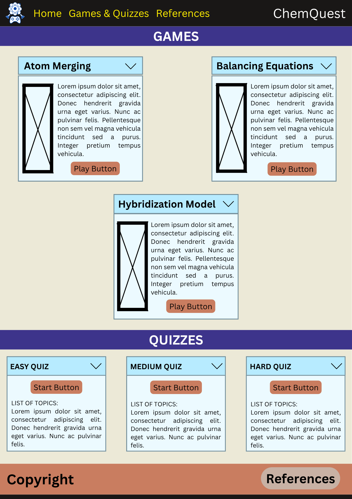
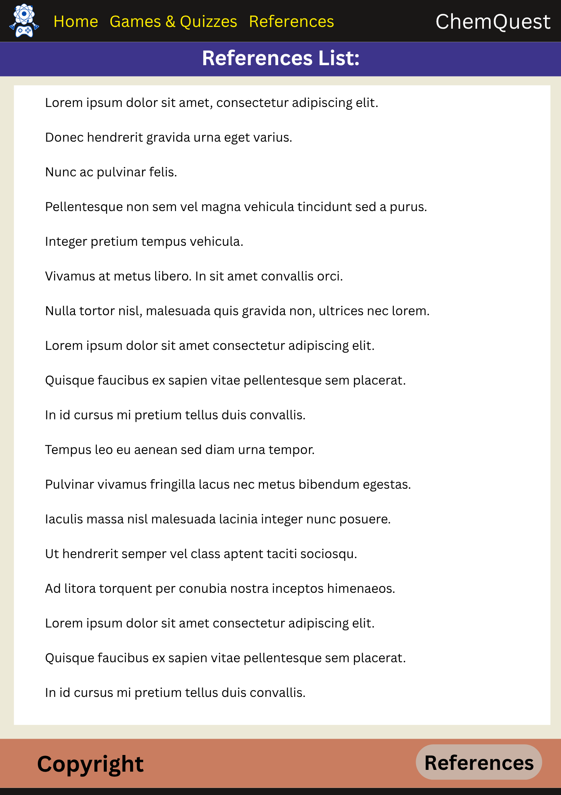
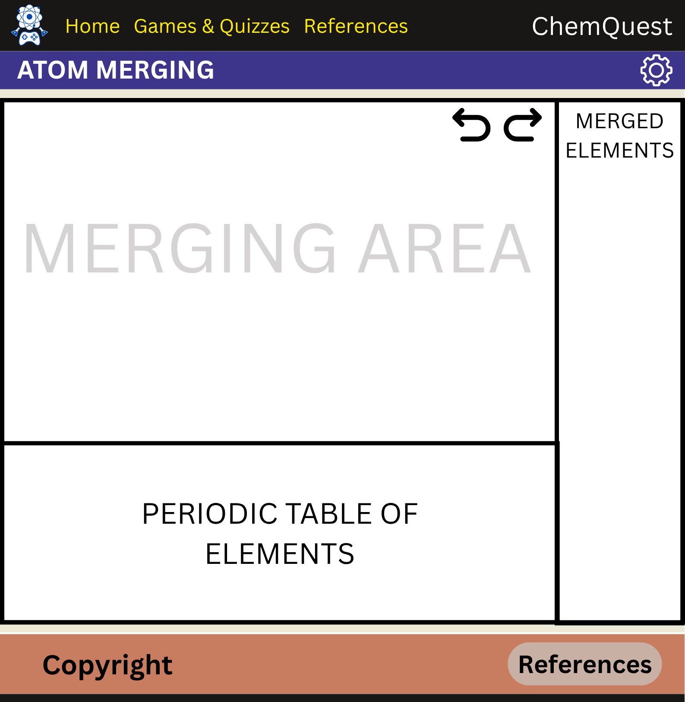
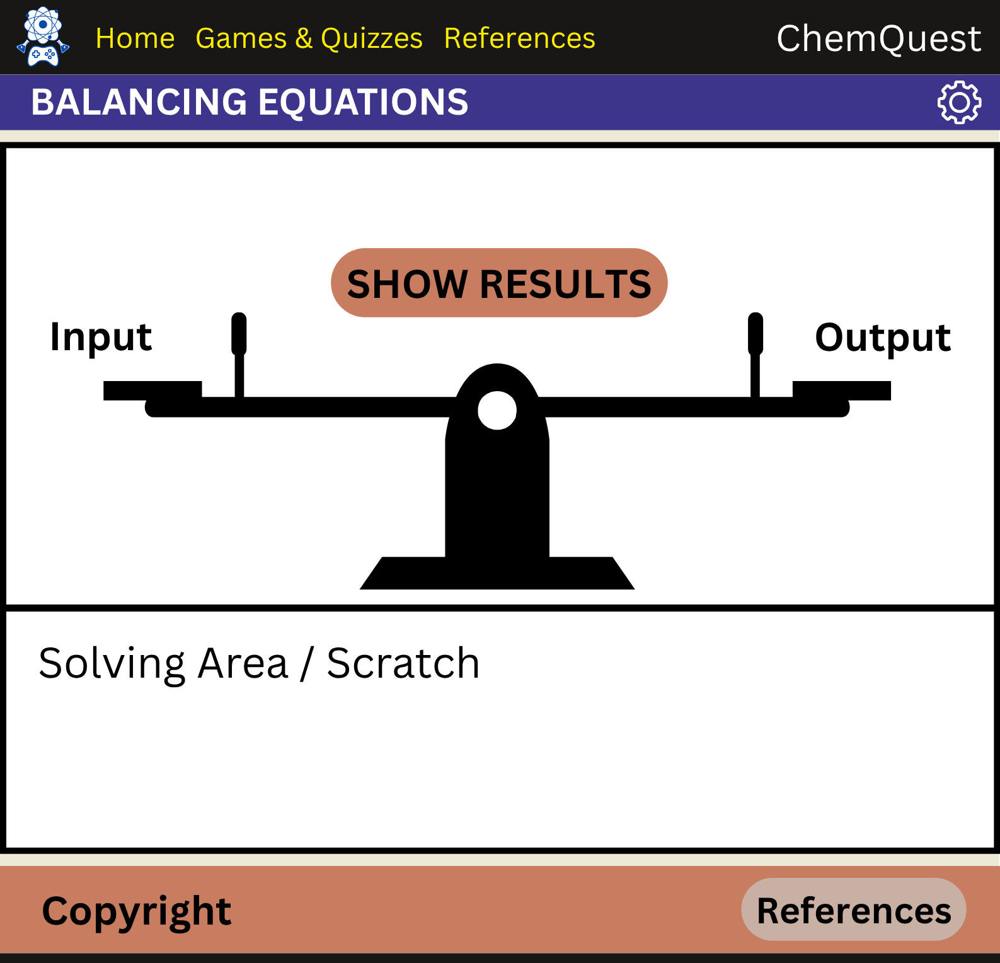
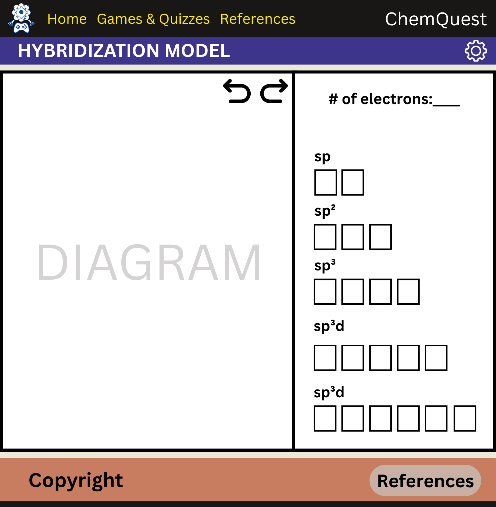
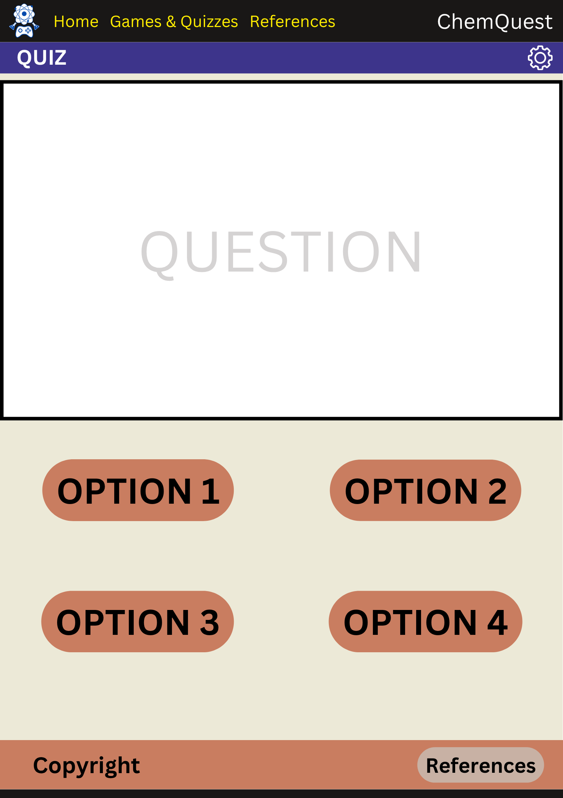
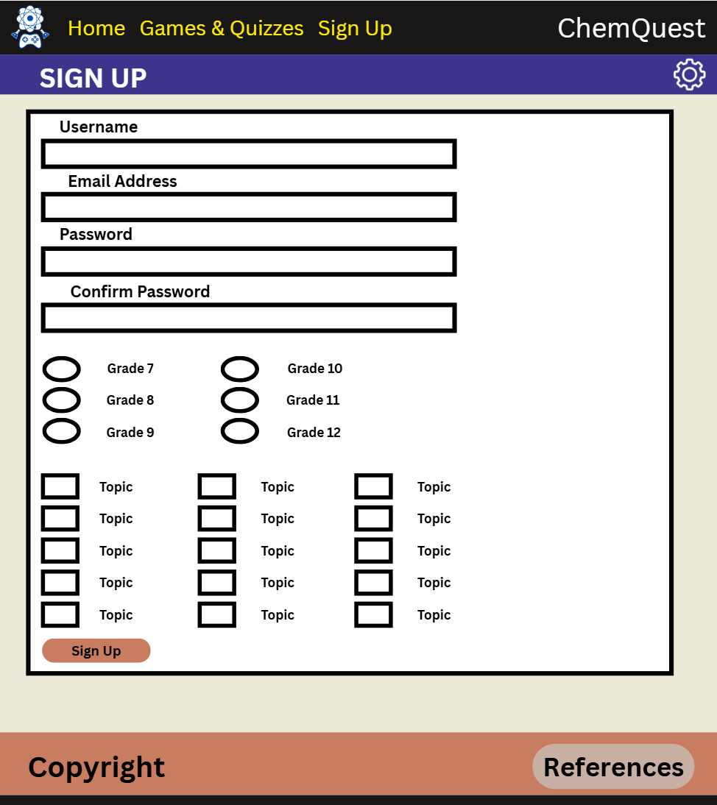
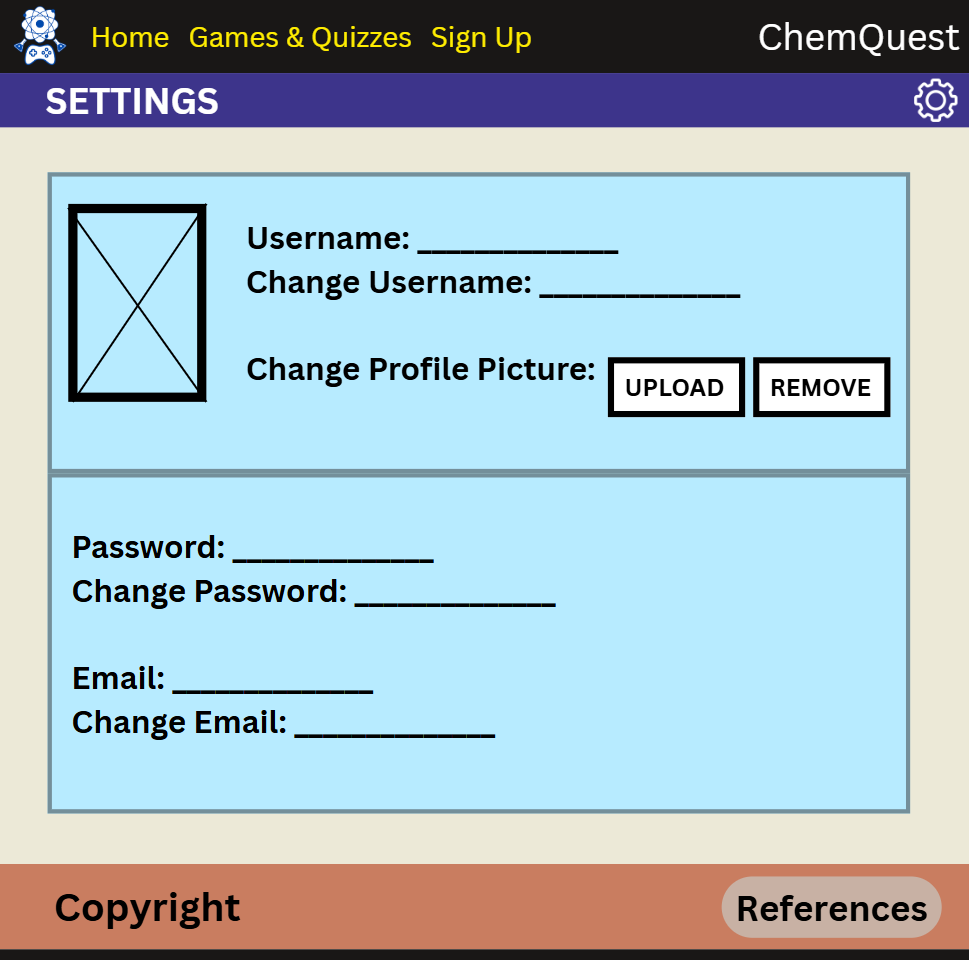
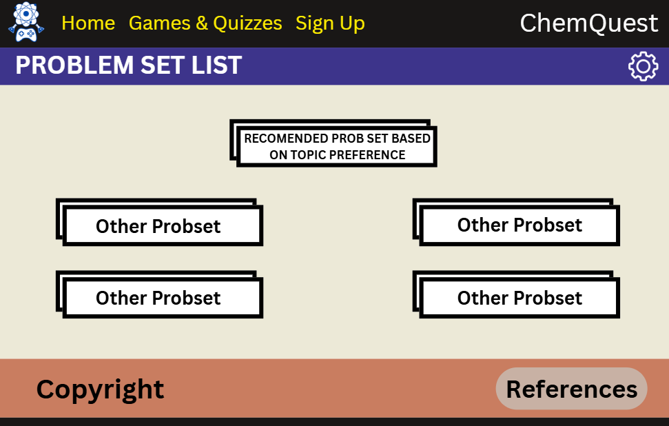

# Project Proposal 
## ChemPlay

### Logo:

### Description:
#### Some students just can't learn without some flare intigrated in the lesson. Through games and visual tools, we believe that students will be able to learn and appreciate the subject of chemistry more, especially since it is a bit complicated if you can't visualize certain topics.  

******
# Page Breakdown:
- Page 1, Home: This page contains the main menu of the games, a small introduction to the website and the things it has to offer, and an About Us section.
- Page 2, Game Directory: This page will contain all the games/tools the user can play related to chemistry. 
- Page 3, References: This page will contain all the sources that we will use thoughout the project. 
- Page 4, Atom Merging Game: This page contains a drag and drop game similar to Little Alchemy. In this page, the user can get any element from the periodic table and merge it with another element. For example, the user gets the element Na and places it on the blank space right above the periodic table. Then, the user gets Cl and places it on top of the Na, forming NaCl or Sodium Chloride. 
- Page 5, Balancing Equations Game: This page contains a container with a chemical equation on its top, an image of a seesaw-like structure carrying all the coefficients in the equation, and a small button at its bottom that opens a space for scratch. This page allows the user to visualize balancing equations by literally "balancing" equations. After an equation is balanced, another equation will be given.
- Page 6, Octet Finding Game: This page contains a small molecular biology model in the middle of a container. This allows the user to see the relationship between the molecular biology of an atom with its orbital diagram. 
- Page 7-9, Chemistry mini quiz: These pages contain the actual chem quiz the user selected in the selector. There are three different pages for this because each difficulty has a different quiz.
- Page 10, Sign up Page: This page will gather all the needed user data to create an account and access recommendations for problemsets based on the user's interests.
- Page 11, User Settings: This page will allow the user to change their username, profile picture, password, and email. (Profile Picture will be added to the top navbar next to the website title)
- Page 12, Problem Set List: This page will contain pdf files which will contain sample questions that the user can download and answer. The recommendation file will be based on the chosen topics in the sign up form.

******

## How JS will be applied to the code: 
We plan to use JS in the webpages containing the games. For the first game (Atom Merging Game), we will use JS to track if two atoms can form a valid molecule and send warnings if an atom cannot be bonded. For the second game (Chemistry mini quiz), JS can be used to randomize the question and option order, keep track of the score, and give out a limited amount of hints. For the third game (Balancing Equations Game), we'll use JS to give out hints to the user and check if the equation really is balanced. Lastly, for the final game (Octet Finding Game), we'll use JS to warn the user if they're placing too much electrons.

******
#### Wireframes:

### First Page, Home

### Second Page, Game Directory

### Third Page, References

### Fourth Page, Atom Merging

### Fifth Page, Balancing Equations

### Sixth Page, Hybridization Model

### Seventh to Ninth Page, Quizzes

### Tenth Page, Quizzes

### Eleventh Page, Quizzes

### Twelfth Page, Quizzes

******
